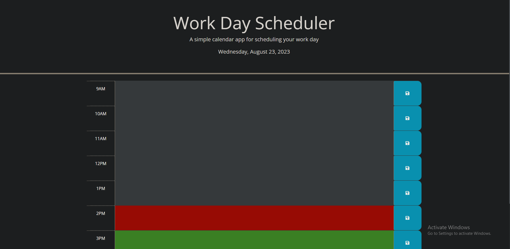

# Work Day Planner

## Talbe of Contents

- [Description](#description)
- [Images](#images)
- [Link](#link)
- [Creator](#creator)

## Description

This project uses localstorage and Day.js to create a planner for the 9am - 5pm work day. By using localstorage the application can store user inputs to be viewed later by the user when the page is reloaded. By using  three colors the application can show you the current hour, past hours and future hours with grey, red, and gree.

## Images

## Link

https://northgoddard.github.io/Work-Day-Planner/

## Creator

- North Goddard (https://github.com/northgoddard)

